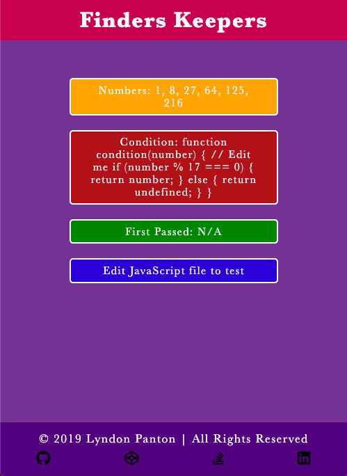

# Finder Keepers

## How To Open
> 1. Go to the project's download folder
> 2. Right click on the file named _index.html_
> 3. Choose the _open with_ option
> 4. Open the application in your desired browser

## How To Use
> 1. Edit the array and condition in the JavaScript file
> 2. The numbers in the array, condition and first element that passed the condition will be displayed

## Requirements
> 1. This project requires a browser to run
> 2. The browser must have JavaScript available and enabled

## Extra Information
> 1. This was done for one of freecodecamp's Basic Algorithm Scripting activities

## Preview

